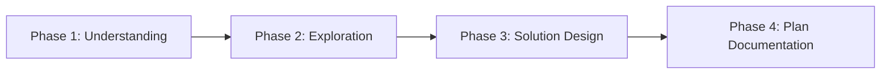

# Claude Code Plan Mode: How It Works and User Interaction

> Detailed Plan Mode guide based on Claude Code v2.1.31 (2026-02-03)

## 📋 Table of Contents

- [What is Plan Mode?](#what-is-plan-mode)
- [Entry/Exit Mechanism](#entryexit-mechanism)
- [Plan Mode Routing Mechanism](#plan-mode-routing-mechanism)
- [Plan Mode Constraints](#plan-mode-constraints)
- [Plan Mode Types](#plan-mode-types)
- [User Interaction Process](#user-interaction-process)
- [Specific Workflow Examples](#specific-workflow-examples)
- [Plan File Writing Guide](#plan-file-writing-guide)

---

## What is Plan Mode?

Plan Mode is a special mode in Claude Code that **designs implementation strategies and obtains user approval before writing code**.

### Key Characteristics

- **Read-Only**: Cannot modify/create/delete files
- **Exploration-First**: Understanding existing codebase patterns
- **User Collaboration**: Clarifying requirements through questions rather than assumptions
- **Plan Documentation**: Writing step-by-step implementation plans for approval

---

## Entry/Exit Mechanism

### ExitPlanMode Tool

**Role:**
- Reads the plan file and displays an approval dialog to the user
- Does not receive plan content as a parameter (automatically reads from file)
- Only used for planning tasks that require writing implementation code

**Cautions:**
- Do NOT ask "Is this plan okay?" using `AskUserQuestion`
- ExitPlanMode itself is the approval request mechanism
- Do NOT use for research/exploration tasks

### Plan Mode Re-entry

When re-entering Plan Mode after previously exiting:

1. **Read existing plan file**: Review the plan written in the previous session
2. **Evaluate current request**:
   - **New task**: Completely overwrite existing plan
   - **Continuation task**: Modify existing plan (remove outdated sections)
3. **Required**: Must update the plan file before calling ExitPlanMode

---

## Plan Mode Routing Mechanism

Claude Code's Plan Mode operates in the order of **user entry → automatic routing → appropriate mode activation**.

### Entry Methods

Plan Mode can be entered in 3 ways:

1. **Keyboard shortcut**: Press `Shift+Tab` twice
2. **Command**: Enter `/plan` (v2.1.0+)
3. **Model selection**: Option 4 (Opus 4.5 Plan Mode) in `/model` command

### Routing Logic

After entering Plan Mode, Claude Code **automatically evaluates task complexity and context** to select the appropriate Plan Mode type.

```
User Trigger (Shift+Tab×2 or /plan)
    ↓
┌─────────────────────────────────┐
│  Claude Code Evaluation Engine   │
│  - Task complexity               │
│  - Required exploration scope    │
│  - Parallel processing needs     │
└──────────────┬──────────────────┘
               │
    ┌──────────┴──────────┐
    │                     │
[Simple Task]        [Complex Task]
    │                     │
    ▼                     ▼
┌─────────┐         ┌──────────────┐
│Enhanced │         │  5-Phase     │
│Plan     │         │  Plan        │
│Mode     │         │  Mode        │
└─────────┘         └──────────────┘
    │                     │
    │              ┌──────┴──────┐
    │              │             │
    │         [Parallel     [Parallel
    │          Explore]      Plan]
    │         [Agents 1-N]  [Agents 1-M]
    │              │             │
    └──────────────┴─────────────┘
                   │
            ┌──────┴──────┐
            │             │
      [Iterative]   [Direct Plan
      [User          Writing]
       Interview]   [Enhanced
                     Workflow]
```

### Mode Selection Criteria

| Condition | Selected Mode | Rationale |
| ---- | ------------ | ---- |
| Single file or clear scope | **Enhanced Plan Mode** | 4-phase workflow is sufficient |
| Uncertain scope, multiple modules affected | **5-Phase Plan Mode** | Parallel exploration agents needed |
| Unclear requirements, many questions | **Iterative Plan Mode** | User interview workflow |
| Called from Plan subagent | **Subagent Plan Mode** | Simplified prompt |

**Important:** Mode selection is **automatic**, and users do not explicitly choose. Claude Code decides based on the system prompt and context.

### Environment Variable Controls

Some behaviors can be controlled via environment variables:

```bash
# Set number of parallel exploration agents (5-Phase mode)
export PLAN_V2_EXPLORE_AGENT_COUNT=3

# Plan file save location (can also be set in settings.json)
# settings.json: { "plansDirectory": "~/.claude/plans" }
```

### Built-in Plan Subagent

When additional research is needed within Plan Mode, Claude Code uses a **Plan Subagent**:

| Attribute | Value |
| ---- | ---- |
| **Model** | Inherited from main conversation |
| **Tools** | Read-only tools only (Write, Edit forbidden) |
| **Purpose** | Codebase research during Plan Mode |
| **Feature** | Subagents cannot spawn other subagents (prevents infinite nesting) |

### Routing Version History

Plan Mode routing has evolved through several versions:

| Version | Changes |
| ---- | -------- |
| **v2.1.16** | Introduced 5-Phase, Iterative, Subagent modes |
| **v2.1.16** | Added `PLAN_V2_EXPLORE_AGENT_COUNT` environment variable |
| **v2.1.20** | Major main prompt refactoring (2896→269 tokens) |
| **v2.1.30** | Added "reuse existing functions" instruction to all modes |
| **v2.1.31** | Added Agent memory instructions |

### Practical Routing Examples

#### Example 1: Simple Feature Addition

```
[User] Add a dark mode toggle button
       ↓
[Evaluation] - Single feature
             - Clear scope
             - Can reference existing patterns
       ↓
[Routing] Enhanced Plan Mode (4 phases)
```

#### Example 2: Complex Refactoring

```
[User] Improve API error handling overall
       ↓
[Evaluation] - Affects multiple modules (Frontend, Backend, Logging)
             - Uncertain scope
             - Architecture decisions needed
       ↓
[Routing] 5-Phase Plan Mode
       ↓
[Phase 1] 3 Explore Agents run in parallel
          - Agent 1: Frontend exploration
          - Agent 2: Backend exploration
          - Agent 3: Logging exploration
       ↓
[Phase 2] 2 Plan Agents run in parallel
          - Plan Agent 1: Security perspective
          - Plan Agent 2: UX perspective
```

#### Example 3: Unclear Requirements

```
[User] Improve the app's performance
       ↓
[Evaluation] - Unclear requirements (which performance? where?)
             - User input needed
       ↓
[Routing] Iterative Plan Mode
       ↓
[Workflow] Exploration → Questions → Plan Update
           ↓               ↓            ↓
       Profiling      "Which part    Incremental
       analysis       is slow?"      plan updates
```

### Summary of Differences Between Modes

| Feature | Enhanced | Iterative | 5-Phase | Subagent |
| ---- | -------- | --------- | ------- | -------- |
| **Parallel agents** | ❌ | ❌ | ✅ | ❌ |
| **User questions** | As needed | Active | As needed | As needed |
| **Workflow** | 4-phase linear | Iterative | 5-phase parallel | Simplified |
| **Suitable for** | Clear tasks | Unclear requirements | Complex tasks | Subagents |
| **Prompt size** | 633 tokens | 915 tokens | 1,396 tokens | 310 tokens |

---

## Plan Mode Constraints

Plan Mode agents are **absolutely forbidden** from:

```bash
# ❌ Forbidden operations
- Creating/modifying/deleting files
- Moving/copying files
- Creating temporary files
- Executing the following commands via bash:
  * mkdir, touch, rm, cp, mv
  * git add, git commit
  * npm install, pip install
  * All file creation/modification related commands
```

**Allowed operations:**
```bash
# ✅ Allowed tools
- Glob: File pattern search
- Grep: Code content search
- Read: File reading
- Task(Explore): Run parallel exploration agents
- Task(Plan): Run parallel plan agents
- AskUserQuestion: Ask questions to user

# Or exploration MCPs (e.g., Serena)
```

---

## Plan Mode Types

Claude Code supports 3 Plan Mode variants:

### 1. Enhanced Plan Mode

**4-Phase Workflow:**



#### Phase 1: Understanding
- Grasp user requirements
- Set architecture perspective
- Define task scope

#### Phase 2: Exploration
- Investigate existing code patterns
- Discover reusable functions
- Analyze similar feature implementations
- Understand architecture

#### Phase 3: Solution Design
- Develop approach based on discovered patterns
- Consider trade-offs
- Follow existing conventions

#### Phase 4: Plan Documentation
- Step-by-step implementation strategy
- Dependency order
- Anticipated issues
- **Required**: "Critical Files for Implementation" section (3-5 key files)

### 2. Iterative Plan Mode

**User Interview-Centric Approach:**

```
[Exploration] ↔ [User Questions] ↔ [Plan Update] ↔ [More Exploration]
      ↓              ↓                  ↓                  ↓
   Findings     Clarify          Incremental plan     Additional
               requirements        improvement        exploration
```

**Characteristics:**
- Clarify requirements through questions rather than assumptions
- Continuously update plan file after each exploration stage
- Efficient question batching (group questions when possible)
- Don't ask questions that can be answered by exploring the codebase

### 3. 5-Phase Plan Mode (Multi-Agent Parallel Planning Mode)

**Parallel Agent Coordination Workflow:**

```
Phase 1: Initial Understanding
  └─> Launch N explore agents IN PARALLEL
       ├─> Agent 1: Frontend exploration
       ├─> Agent 2: Backend API exploration
       └─> Agent 3: Database schema exploration

Phase 2: Design
  └─> Launch M plan agents IN PARALLEL
       ├─> Plan Agent 1: Security perspective
       └─> Plan Agent 2: Performance perspective

Phase 3: Review
  └─> Validate alignment with user intent

Phase 4: Final Plan
  └─> Generate unified plan document

Phase 5: Completion
  └─> AskUserQuestion OR ExitPlanMode
```

**Agent Count Guidelines:**
- **Simple changes**: 1 explore agent
- **Uncertain scope**: Multiple explore agents (different codebase areas)
- **Complex modifications**: Multiple plan agents (various architecture perspectives)

---

## User Interaction Process

User interaction in Plan Mode is done through the **AskUserQuestion tool**.

### Question Strategy

#### 1. When to Ask Questions?

```python
# ✅ Cases to ask questions
- Resolve unclear requirements
- Gather input on technical decisions and trade-offs
- Understand preferences for UI/UX, performance, edge cases
- Verify understanding before finalizing approach

# ❌ Cases NOT to ask questions
- Things that can be answered by exploring the codebase
- "Is this plan okay?" (ExitPlanMode handles this)
- Obvious technical choices
```

#### 2. Efficient Question Batching

**Bad example (sequential questions):**
```
[Agent] What authentication method do you want?
[User] JWT
[Agent] What should be the token expiration time?
[User] 1 hour
[Agent] Do you want to use refresh tokens?
[User] Yes
```

**Good example (batched questions):**
```
[Agent] I need a few decisions for authentication implementation:

1. What authentication method would you like?
   - JWT (stateless, scalable)
   - Session (stateful, simpler)
   - OAuth 2.0 (third-party)

2. If you choose JWT:
   - Token expiration time: 15 min / 1 hour / 24 hours?
   - Use refresh tokens?
   - Token storage location: localStorage / httpOnly cookie?

3. Security requirements:
   - Need MFA (multi-factor authentication)?
   - Password policy?
```

#### 3. AskUserQuestion Tool Usage

```typescript
// Claude Code's AskUserQuestion tool structure
{
  questions: [
    {
      question: "What caching strategy would you like to use?",
      header: "Caching",  // Short label (max 12 chars)
      multiSelect: false,  // Single selection
      options: [
        {
          label: "Redis (Recommended)",
          description: "Suitable for distributed environments, high performance, some operational overhead"
        },
        {
          label: "In-Memory",
          description: "Simple, fast, single instance only"
        },
        {
          label: "File-based",
          description: "No external dependencies, slow, easier to debug"
        }
      ]
    }
  ]
}
```

### Conversation Flow Examples

#### Example 1: Adding a New Feature (Dark Mode)

```
[User] Add dark mode to the app

[Claude enters Plan Mode]

[Phase 1: Understanding]
  - Requirement: Dark mode toggle feature
  - Scope: UI theme switching system

[Phase 2: Exploration]
  [Reading existing code...]
  - Found: Using React Context API
  - Found: Using CSS-in-JS (styled-components)
  - Found: Saving user settings to localStorage

[User Interaction via AskUserQuestion]
┌─────────────────────────────────────────┐
│ I need a few decisions for dark mode    │
│ implementation:                          │
│                                          │
│ 1. Theme switching scope                 │
│    - Entire app (all pages)             │
│    - Specific components only           │
│                                          │
│ 2. Save user preference                  │
│    - localStorage (matches current      │
│      pattern)                           │
│    - Backend user profile               │
│    - Follow system settings             │
│      (prefers-color)                    │
│                                          │
│ 3. Default theme                         │
│    - Light mode                         │
│    - Dark mode                          │
│    - System setting                     │
└─────────────────────────────────────────┘

[User Response]
- Apply to entire app
- Use localStorage (keep existing pattern)
- System setting as default

[Phase 3: Solution Design]
  Approach:
  1. Extend ThemeContext (leverage existing context pattern)
  2. Define themes using CSS variables
  3. Detect initial value with prefers-color-scheme media query
  4. localStorage sync

[Phase 4: Plan Documentation]
  [Writing plan file...]

[Phase 5: Completion]
  [ExitPlanMode called - User approval dialog shown]
```

#### Example 2: Complex Refactoring (API Error Handling)

```
[User] Improve API error handling overall

[Claude enters Plan Mode - 5-Phase variant]

[Phase 1: Initial Understanding]
  - Complexity: High (affects entire codebase)
  - Parallel exploration needed

  [Launching 3 Explore Agents IN PARALLEL]
  ├─> Agent 1: "Explore Frontend API client error handling"
  ├─> Agent 2: "Explore Backend error response format"
  └─> Agent 3: "Explore current Error logging/monitoring"

[Results from Explore Agents]
  Agent 1:
    - Found: Using axios interceptor
    - Issue: Error handling logic scattered across components
    - Found: Inconsistent error message display

  Agent 2:
    - Found: Express error middleware exists but incomplete
    - Found: Inconsistent HTTP status codes
    - Found: No structured error response format

  Agent 3:
    - Found: Using Winston logger
    - Issue: Some error logging missing
    - Found: Sentry configured but lacking error context

[User Interaction via AskUserQuestion]
┌─────────────────────────────────────────┐
│ I need architecture decisions for error  │
│ handling improvement:                    │
│                                          │
│ 1. Error classification strategy         │
│    ○ By domain (Auth, Payment, User...) │
│    ○ By type (Validation, Network,      │
│              Permission...)             │
│    ○ Hybrid (combine both)              │
│                                          │
│ 2. Error level shown to users            │
│    ☑ Technical errors → Generic message │
│    ☑ Validation errors → Specific       │
│    ☑ Permission errors → Redirect       │
│    ☐ All errors → Raw message           │
│                                          │
│ 3. Error recovery strategy               │
│    ○ Auto retry (network errors)        │
│    ○ Manual retry button only           │
│    ○ Global error boundary              │
└─────────────────────────────────────────┘

[User Response]
- By type classification
- Technical errors generic, others specific
- Auto retry + global error boundary

[Phase 2: Design]
  [Launching 2 Plan Agents IN PARALLEL]
  ├─> Plan Agent 1: "Design error response from Security perspective"
  └─> Plan Agent 2: "Design frontend error display from UX perspective"

[Results from Plan Agents]
  Plan Agent 1 (Security):
    - Prevent sensitive info exposure (remove stack trace)
    - Distinguish rate limiting errors
    - Enable server log tracing via error ID

  Plan Agent 2 (UX):
    - Toast notification for transient errors
    - Error boundary for catastrophic errors
    - Inline validation for form errors
    - Retry button with exponential backoff

[Phase 3: Review]
  Critical Files confirmed:
  - src/api/client.ts (axios interceptor)
  - src/server/middleware/errorHandler.ts
  - src/components/ErrorBoundary.tsx
  - src/types/errors.ts
  - src/utils/errorLogger.ts

[Phase 4: Final Plan]
  [Writing unified plan document...]

  Plan Summary:
  1. Backend: Define structured error response format
  2. Backend: Complete Express error middleware
  3. Frontend: Centralized error handling utility
  4. Frontend: Implement React Error Boundary
  5. Common: TypeScript error type definitions
  6. Integration: Sentry context enrichment

[Phase 5: Completion]
  [ExitPlanMode called]
```

---

## Specific Workflow Examples

### Workflow Diagram

```
┌─────────────────────────────────────────────────────────────┐
│                    User: "Add a new feature"                 │
└────────────────────────────┬────────────────────────────────┘
                             │
                             ▼
              ┌──────────────────────────┐
              │  Claude Judgment:        │
              │  - Evaluate complexity   │
              │  - Plan Mode needed?     │
              └──────────┬───────────────┘
                         │
              ┌──────────┴──────────┐
              │                     │
          [Simple]              [Complex]
              │                     │
              ▼                     ▼
    ┌─────────────────┐    ┌──────────────────┐
    │ Implement       │    │ EnterPlanMode    │
    │ directly        │    └────────┬─────────┘
    └─────────────────┘             │
                    ╔════════════════╧════════════════╗
                    ║      PLAN MODE ACTIVATED        ║
                    ╚════════════════╤════════════════╝
                                     │
                    ┌────────────────┴────────────────┐
                    │   Phase 1: Understanding        │
                    │   - Read user request           │
                    │   - Define scope                │
                    └────────────────┬────────────────┘
                                     │
                    ┌────────────────┴────────────────┐
                    │   Phase 2: Exploration          │
                    │   - Glob/Grep/Read files        │
                    │   - Launch Explore agents       │
                    │   - Find existing patterns      │
                    └────────────────┬────────────────┘
                                     │
                    ┌────────────────┴────────────────┐
                    │   User Interaction Point 1      │
                    │   - AskUserQuestion             │
                    │   - Clarify requirements        │
                    │   - Get technical preferences   │
                    └────────────────┬────────────────┘
                                     │
                            ┌────────┴────────┐
                            │                 │
                    [More exploration]   [Proceed]
                            │                 │
                            └────────┬────────┘
                                     │
                    ┌────────────────┴────────────────┐
                    │   Phase 3: Solution Design      │
                    │   - Design approach             │
                    │   - Consider trade-offs         │
                    │   - Follow conventions          │
                    └────────────────┬────────────────┘
                                     │
                    ┌────────────────┴────────────────┐
                    │   User Interaction Point 2      │
                    │   - Present design options      │
                    │   - Get architecture decisions  │
                    └────────────────┬────────────────┘
                                     │
                    ┌────────────────┴────────────────┐
                    │   Phase 4: Plan Documentation   │
                    │   - Write plan.md               │
                    │   - Step-by-step strategy       │
                    │   - Critical files list         │
                    │   - Verification procedures     │
                    └────────────────┬────────────────┘
                                     │
                    ┌────────────────┴────────────────┐
                    │   Phase 5: Completion           │
                    │   - ExitPlanMode                │
                    └────────────────┬────────────────┘
                                     │
                    ╔════════════════╧════════════════╗
                    ║   USER APPROVAL DIALOG          ║
                    ╚════════════════╤════════════════╝
                                     │
                            ┌────────┴────────┐
                            │                 │
                       [Approved]        [Rejected]
                            │                 │
                            ▼                 ▼
                    ┌──────────────┐   ┌─────────────┐
                    │ Start Coding │   │ Re-plan or  │
                    │              │   │ Cancel      │
                    └──────────────┘   └─────────────┘
```

---

## Plan File Writing Guide

Plan Mode must write a **plan file**, which serves as the basis for user approval.

### Required Sections

```markdown
# Implementation Plan: [Feature Name]

## 1. Overview
- **Goal**: [What are we trying to achieve]
- **Scope**: [What will be changed]
- **Approach**: [How will we implement it]

## 2. Current State Analysis
- **Existing Patterns**: [Discovered patterns]
- **Reusable Functions**: [Reusable functions]
  - `functionName()` in `src/path/to/file.ts:42`
- **Constraints**: [Technical constraints]

## 3. Proposed Solution

### Architecture Decisions
- [Key architecture decisions]
- [Trade-offs explanation]

### Implementation Steps
1. **Step 1**: [Specific task]
   - File: `path/to/file1.ts`
   - Changes: [Change details]
   - Dependencies: None

2. **Step 2**: [Specific task]
   - File: `path/to/file2.ts`
   - Changes: [Change details]
   - Dependencies: After Step 1 complete

3. **Step 3**: [Specific task]
   - File: `path/to/file3.ts`
   - Changes: [Change details]
   - Dependencies: After Steps 1, 2 complete

[... more steps ...]

## 4. Critical Files for Implementation
| File | Purpose | Priority |
|------|---------|----------|
| `src/api/client.ts:15` | API call logic | High |
| `src/components/Button.tsx:42` | UI component | High |
| `src/types/api.ts:8` | Type definitions | Medium |
| `src/utils/validation.ts:120` | Validation logic | Medium |
| `src/config/env.ts:5` | Environment settings | Low |

## 5. Anticipated Challenges
- **Challenge 1**: [Issue]
  - **Mitigation**: [Solution]
- **Challenge 2**: [Issue]
  - **Mitigation**: [Solution]

## 6. Testing & Verification

### Unit Tests
- [ ] `functionName()` in `src/path/to/file.test.ts`
- [ ] Edge case: [Description]

### Integration Tests
- [ ] API endpoint: `POST /api/endpoint`
- [ ] UI flow: [Description]

### End-to-End Verification
1. [Manual test step 1]
2. [Manual test step 2]
3. Expected result: [Expected result]

## 7. Rollback Plan
- [How to rollback if issues occur]
- [How to revert if there's data migration]
```

### Bad Plan vs Good Plan

#### ❌ Bad Plan Example

```markdown
# Dark Mode Implementation

## Plan
1. Add theme state
2. Change colors
3. Add toggle button
4. Save to localStorage

## Files
- Some component files
- CSS files
```

**Issues:**
- No specific file paths
- No existing pattern analysis
- Unclear step dependencies
- No trade-offs considered
- No test plan

#### ✅ Good Plan Example

```markdown
# Implementation Plan: Dark Mode Toggle

## 1. Overview
- **Goal**: Add feature for users to switch between light/dark mode
- **Scope**: Entire app's theme system (affects 48 UI components)
- **Approach**: CSS variables + React Context pattern (extend existing ThemeContext)

## 2. Current State Analysis
- **Existing Patterns**:
  - Using React Context API (`src/contexts/ThemeContext.tsx`)
  - Styling with styled-components
  - Managing user settings with localStorage (`src/utils/storage.ts`)

- **Reusable Functions**:
  - `useLocalStorage()` in `src/hooks/useLocalStorage.ts:12`
  - `getSystemTheme()` in `src/utils/theme.ts:8`

- **Constraints**:
  - Using styled-components v5 (not v6)
  - IE11 support not needed (can use CSS variables)

## 3. Proposed Solution

### Architecture Decisions
1. **Chose CSS variable approach**
   - Trade-off: More flexible than class toggling but slightly slower
   - Rationale: Easy runtime theme changes, compatible with existing styled-components

2. **System setting priority**
   - Detect initial value with prefers-color-scheme media query
   - Save to localStorage when user manually selects

### Implementation Steps

1. **Step 1: Define CSS Variables**
   - File: `src/styles/theme.ts`
   - Changes:
     ```typescript
     export const lightTheme = {
       '--color-bg': '#ffffff',
       '--color-text': '#000000',
       // ... 20 variables
     };
     export const darkTheme = { /* ... */ };
     ```
   - Dependencies: None

2. **Step 2: Extend ThemeContext**
   - File: `src/contexts/ThemeContext.tsx:15`
   - Changes:
     - `theme` state → `{mode: 'light'|'dark', colors: ThemeColors}`
     - Add `toggleTheme()` function
     - Sync localStorage with useEffect
   - Dependencies: After Step 1 complete

3. **Step 3: Modify ThemeProvider**
   - File: `src/App.tsx:42`
   - Changes:
     - Inject CSS variables into GlobalStyle
     - Add prefers-color-scheme detection logic
   - Dependencies: After Step 2 complete

4. **Step 4: Toggle Button Component**
   - File: `src/components/ThemeToggle.tsx` (new)
   - Changes: Create new component
   - Dependencies: After Step 2 complete

5. **Step 5: Place Toggle in Header**
   - File: `src/components/Header.tsx:67`
   - Changes: Add `<ThemeToggle />`
   - Dependencies: After Step 4 complete

6. **Step 6: Migrate Existing Components to CSS Variables**
   - Files: 48 components
     - `src/components/Button.tsx:25`
     - `src/components/Card.tsx:18`
     - [... see Appendix A for full list]
   - Changes: Change hardcoded colors → CSS variables
   - Dependencies: After Steps 1, 2, 3 complete

## 4. Critical Files for Implementation

| File | Purpose | Priority |
|------|---------|----------|
| `src/contexts/ThemeContext.tsx:15` | Theme state management | High |
| `src/styles/theme.ts:1` | Color variable definitions | High |
| `src/App.tsx:42` | Global theme application | High |
| `src/components/ThemeToggle.tsx` | Toggle UI | Medium |
| `src/hooks/useLocalStorage.ts:12` | Settings storage | Medium |

## 5. Anticipated Challenges

- **Challenge 1**: Color migration for 48 components
  - **Mitigation**: Write codemod script for automatic conversion
  - **Fallback**: Manually proceed with high-priority components first

- **Challenge 2**: Image/icon color inversion
  - **Mitigation**: CSS filter for SVGs, prepare separate dark versions for PNGs
  - **Fallback**: Exclude non-critical icons from first release

## 6. Testing & Verification

### Unit Tests
- [ ] `ThemeContext`: Theme toggle behavior
- [ ] `useLocalStorage`: Save/load
- [ ] Edge case: Fallback when localStorage disabled

### Integration Tests
- [ ] Theme persists on page refresh
- [ ] Reflects system setting changes (when user hasn't manually selected)

### End-to-End Verification
1. Initial visit → Follows system setting (dark)
2. Click toggle button → Switch to light mode
3. Refresh → Light mode persists
4. Visit all pages → Verify no color breakage

## 7. Rollback Plan
- ThemeContext changes are backward compatible with previous version
- If issues occur, just remove ThemeToggle component to revert to existing behavior
- localStorage key is newly created as `theme_mode_v2` (preserves existing settings)

---

## Appendix A: Complete Component List
[Detailed paths and line numbers for all 48 files]
```

---

## Summary: Key User Interaction in Plan Mode

### Conversation Flow

```
User Request
    ↓
[Exploration] → Understand existing code
    ↓
[Question 1] ← AskUserQuestion ← Unclear requirements
    ↓
User Answers
    ↓
[More Exploration] → More specific exploration
    ↓
[Question 2] ← AskUserQuestion ← Technical decisions
    ↓
User Answers
    ↓
[Solution Design] → Design approach
    ↓
[Plan Documentation] → Write plan.md
    ↓
[ExitPlanMode] → User approval dialog
    ↓
User Approval/Rejection
    ↓
Implementation or Re-planning
```

### Core Principles

1. **Don't assume** - Ask questions when uncertain
2. **Batch questions** - Multiple questions at once
3. **Don't ask if code can answer** - Explore codebase first
4. **Update plan incrementally** - After each discovery
5. **ExitPlanMode is the approval mechanism** - Don't separately ask "Is this okay?"

---

## References

- [Claude Code GitHub](https://github.com/anthropics/claude-code)
- [Piebald-AI System Prompts](https://github.com/Piebald-AI/claude-code-system-prompts)
- [Claude Code Docs](https://code.claude.com/docs)
- [Plan Mode Guide](https://claude-ai.chat/blog/plan-mode-in-claude-code-when-to-use-it/)

---

**Written**: 2026-02-05
**Version**: Claude Code v2.1.31
**Source**: Claude Code System Prompts (Piebald-AI)
